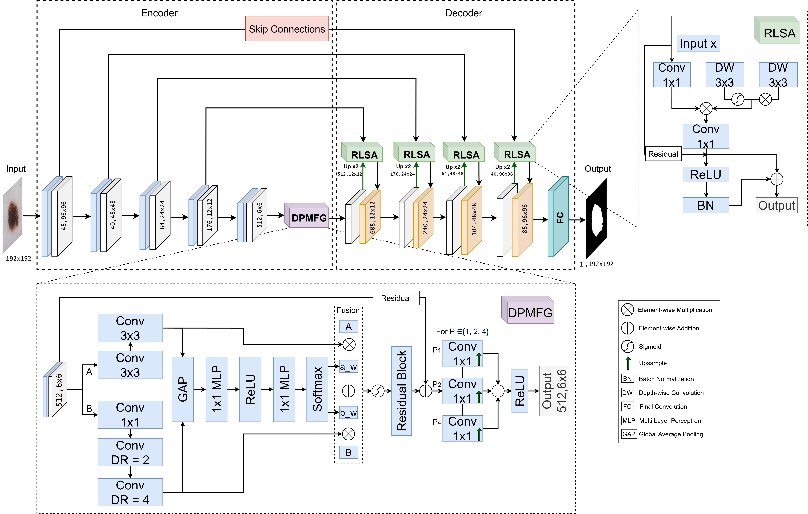

# MRLSA-Net: Multi-scale Residual Local Self-Attention Network for Skin Lesion Segmentation

[](https://www.journals.elsevier.com/biomedical-signal-processing-and-control)
[](https://www.python.org/)
[](https://pytorch.org/)

Official implementation of **"MRLSA-Net: An Attention-Enhanced Framework for Robust Skin Lesion Segmentation"**.

## Overview

MRLSA-Net is a novel deep learning architecture for skin lesion segmentation that combines:
- **Dual-Path Multi-Scale Feature Gating (DPMFG)**: Captures both local details and broader contextual features through parallel standard and dilated convolutions
- **Residual Local Self-Attention (RLSA)**: Enhances lesion-specific details through efficient local attention without the computational demands of global attention mechanisms



## Requirements

```bash
pip install -r requirements.txt
```

**Dependencies:**
- Python >= 3.8
- PyTorch >= 2.0.0
- torchvision >= 0.15.0
- segmentation-models-pytorch >= 0.3.3
- albumentations >= 1.3.0
- opencv-python >= 4.8.0
- scikit-learn >= 1.3.0
- torchmetrics >= 1.0.0
- tqdm >= 4.65.0
- timm >= 0.9.0
- numpy >= 1.24.0
- matplotlib >= 3.7.0

## Dataset Preparation

### ISIC 2018

1. Download from [ISIC Challenge](https://challenge.isic-archive.com/data/#2018):
   - ISIC2018_Task1-2_Training_Input (images)
   - ISIC2018_Task1_Training_GroundTruth (masks)

2. Run preparation script:
```bash
python prepare_datasets.py
# Select option 1 for ISIC 2018
# Enter raw data path and output path
```

### PH2

1. Download from [Kaggle](https://www.kaggle.com/datasets/athina123/ph2dataset)

2. Run preparation script:
```bash
python prepare_datasets.py
# Select option 2 for PH2
```

### HAM10000

**Note:** HAM10000 is primarily a classification dataset. For segmentation, we use third-party masks from [Kaggle](https://www.kaggle.com/datasets/surajghuwalewala/ham1000-segmentation-and-classification).

1. Download images from [ISIC Archive](https://dataverse.harvard.edu/dataset.xhtml?persistentId=doi:10.7910/DVN/DBW86T)
2. Download segmentation masks from [Kaggle](https://www.kaggle.com/datasets/surajghuwalewala/ham1000-segmentation-and-classification)
3. Align masks to images by matching identifiers

```bash
python prepare_datasets.py
# Select option 3 for HAM10000
```

## Training

### 5-Fold Cross-Validation (Recommended)

```bash
python train.py
```

This will:
- Perform 5-fold cross-validation on ISIC-2018
- Save best checkpoints per fold in `checkpoints/fold_X/`
- Report mean ± std metrics across all folds

### Configuration

Key hyperparameters in `config.py`:

| Parameter | Value | Description |
|-----------|-------|-------------|
| `IMAGE_SIZE` | (192, 192) | Input resolution |
| `BATCH_SIZE` | 16 | Batch size |
| `LEARNING_RATE` | 1e-4 | Initial learning rate |
| `NUM_EPOCHS` | 150 | Maximum epochs |
| `TVERSKY_ALPHA` | 0.5 | Tversky loss α |
| `TVERSKY_BETA` | 0.5 | Tversky loss β |
| `N_FOLDS` | 5 | Number of CV folds |
| `VAL_SPLIT` | 0.1 | Validation split within training |
| `EARLY_STOPPING_PATIENCE` | 10 | Early stopping patience |
| `RANDOM_SEED` | 42 | Random seed for reproducibility |

### Preprocessing Details

**CLAHE Parameters (Section 3.1):**
- `clip_limit`: 2.0
- `tile_grid_size`: (8, 8)
- Applied to L-channel of LAB color space

**Data Augmentation (Training only):**
- Horizontal flip (p=0.5)
- Vertical flip (p=0.5)
- Shift-scale-rotate (scale±12%, rotate±15°, shift±12%, p=0.5)
- Random brightness/contrast (p=0.5)
- Grid distortion (p=0.5)
- Elastic transform (α=1.0, σ=50, p=0.5)
- Coarse dropout (p=0.5)

## Inference

```bash
python inference.py
```

Or use in code:

```python
from inference import load_model, inference_single_image
from config import Config

config = Config()
model = load_model("checkpoints/fold_1/best_model_dice_0.9180.pth", config, device)
mask = inference_single_image(model, "path/to/image.png", config, device)
```

## Project Structure

```
MRLSANet/
├── config.py           # Configuration and hyperparameters
├── dataset.py          # Dataset loading and preprocessing
├── models.py           # MRLSA-Net architecture (DPMFG, RLSA)
├── train.py            # 5-fold cross-validation training
├── inference.py        # Inference and visualization
├── utils.py            # Loss functions and utilities
├── prepare_datasets.py # Dataset preparation scripts
├── requirements.txt    # Dependencies
└── checkpoints/        # Saved model checkpoints
    ├── fold_1/
    ├── fold_2/
    ├── fold_3/
    ├── fold_4/
    └── fold_5/
```

## Reproducibility

To ensure reproducibility:

1. **Random seed**: Set to 42 for all experiments
2. **Deterministic operations**: CUDNN deterministic mode enabled
3. **Fixed data splits**: KFold with `random_state=42`

```python
from utils import set_seed
set_seed(42)  # Called automatically in train.py
```


